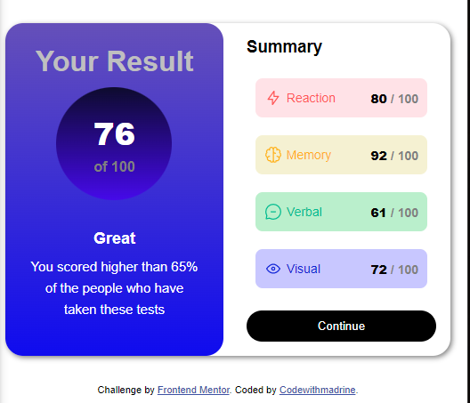

# Frontend Mentor - Results summary component solution

This is a solution to the [Results summary component challenge on Frontend Mentor](https://www.frontendmentor.io/challenges/results-summary-component-CE_K6s0maV). Frontend Mentor challenges help you improve your coding skills by building realistic projects. 

## Table of contents

  - [The challenge](#the-challenge)
  - [Screenshot](#screenshot)
  - [Links](#links)
  - [Built with](#built-with)
  - [What I learned](#what-i-learned)
  - [Continued development](#continued-development)
- [Author](#author)

### The challenge

Users should be able to:

- View the optimal layout for the interface depending on their device's screen size
- See hover and focus states for all interactive elements on the page

### Screenshot

### Links

- Solution URL: [Solution url ](https://github.com/Madrine256/Summary-Responsive-Page-mentor2)
- Live Site URL:[live site url](https://madrine256.github.io/Summary-Responsive-Page-mentor2/)

### Built with

- CSS custom properties
- Flexbox
- CSS Grid
- Desktop-first workflow

### What I learned

Always add background color to your body and containers else browsers use default for unspecified container background-color which is something you might not need.

### Continued development

-Flexbox
-Responsiveness of the page

## Author

- Website - [Soon getting one ](codewithmadrine.com)
- Frontend Mentor - [@Codewithmadrine](https://www.frontendmentor.io/profile/codewithmadrine)
- Twitter - [@MadrixMadrin](https://www.twitter.com/MadrixMadrin)